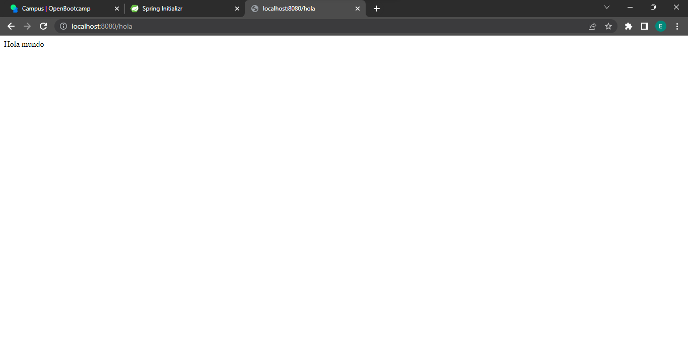
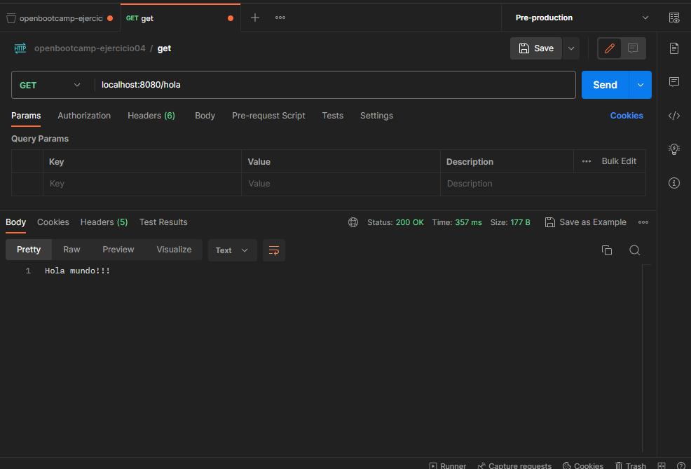
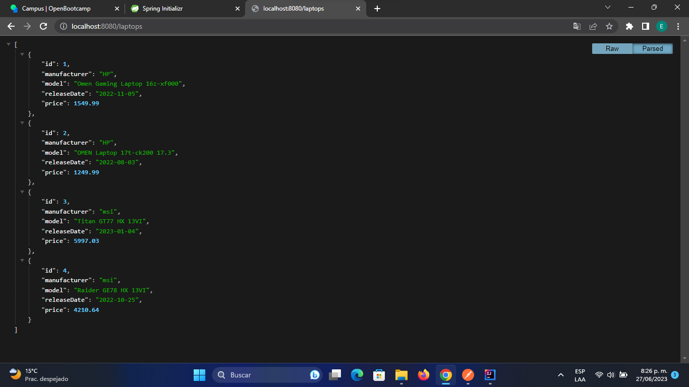
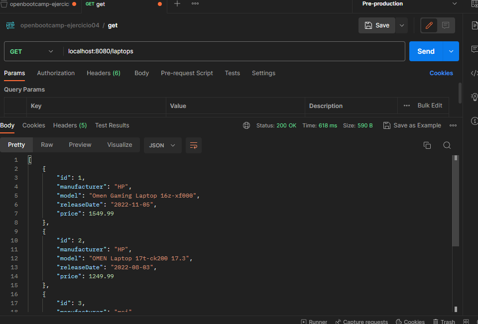
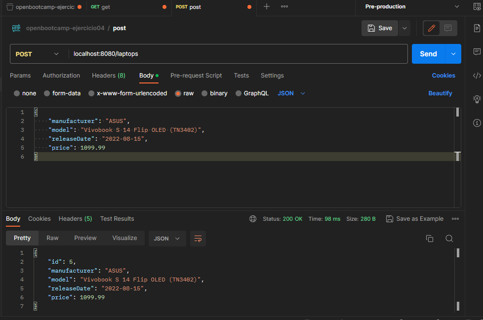
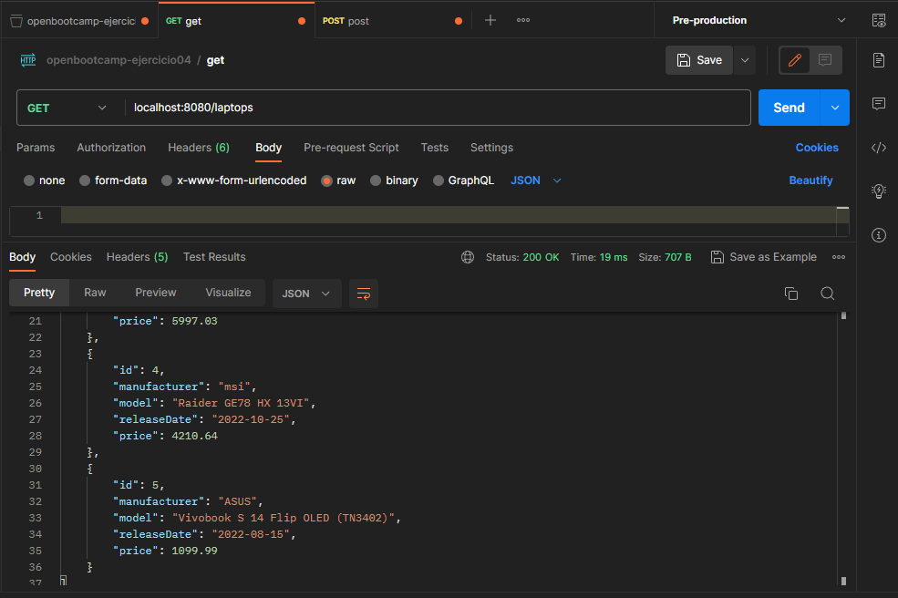

## Enunciado ejercicio 4: ##
Crear un proyecto Spring Boot con las dependencias:

* H2
* Spring Data JPA 
* Spring Web 
* Spring Boot dev tools

Crear una clase HelloController que sea un controlador REST. Dentro de la clase crear un método que retorne un saludo. Probar que retorna el saludo desde el navegador y desde Postman.

### Solución: ###

Al visitar la url http://localhost:8080/hola, en el navegador se pudo observar:

Y al realizar la consulta con Postman:

## Ejercicio 5: ##

Dentro de la misma app crear las clases necesarias para trabajar con "ordenadores":

* Laptop (entidad)

* LaptopRepository (repositorio)

* LaptopController (controlador)

Desde LaptopController crear un método que devuelva una lista de objetos Laptop.

Probar que funciona desde Postman.

Los objetos Laptop se pueden insertar desde el método main de la clase principal.

### Solución: ###
Se insertaron 4 objetos de tipo Laptop desde el método main, al visitar la url http://localhost:8080/laptops, se pudo observar esto en el navegador:

Al realizar la consulta por medio de Postman, se obtuvo:

## Ejercicio 6 ##

Crear un método en LaptopController que reciba un objeto Laptop enviado en formato JSON desde Postman y persistirlo en la base de datos.

Comprobar que al obtener de nuevo los laptops aparece el nuevo ordenador creado.

### Solución: ###

Creación de un nuevo elemento mediante el método POST usando Postman:

Al listar todos los elementos, aparece el elemento creado:

